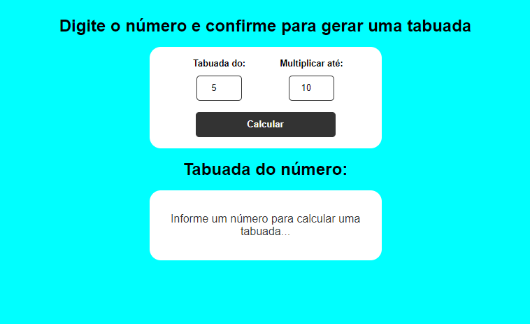
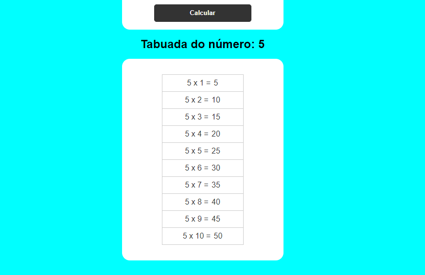

# Tabuada - Tabuada de Multiplicação.

> Projeto básico desenvolvido com JavaScript, HTML e CSS.

Esse projeto é um software de tabuada.

O usuário digita o número e a quantidade de vezes que esse número será multiplicado.

Abaixo é apresentado o resultado:

## Tecnologias
- JavaScript
- HTML
- CSS
- Git e GitHub
